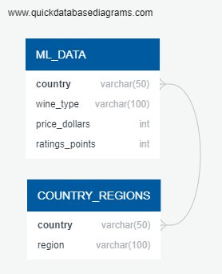
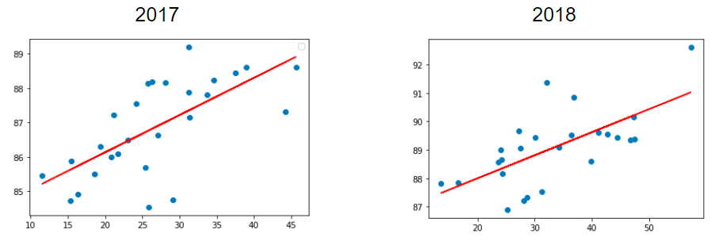
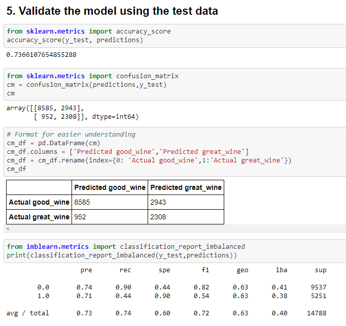
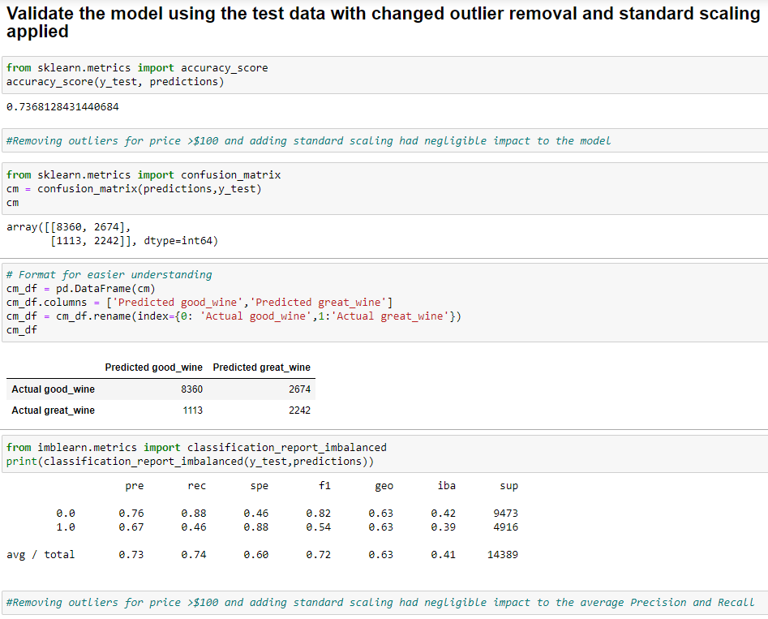
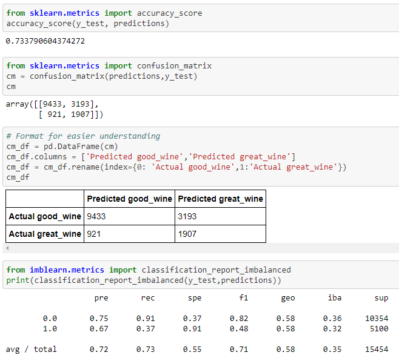
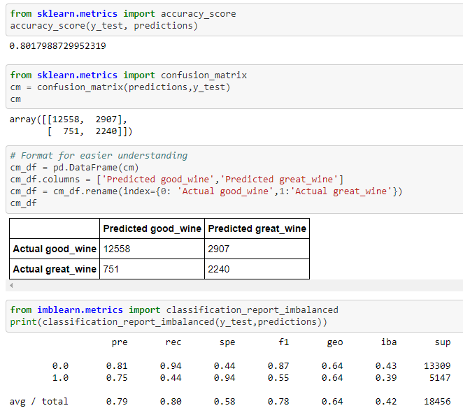

# Wine Reviews and Ratings Analysis

## Overview:
_(Selected topic)_

This project is meant to determine whether the rating of a particular wine can be predicted the following year via the use of a machine learning model.   Through the duration of the project, the model has evolved using ratings/points and prices.

## Purpose:
_(Reason why selected topic, description of source data, questions hope to answer with the data)_

The team has selected the topic of wine. The reason why this topic was selected is the wine industry is increasingly incorporating Machine Learning and AI into their business models and operations. Wine's popularity has increased among consumers and especially more so during this pandemic. Our source data is from the website winemag.com.  The data had a variety of data points such as review of each particular type of wine, its variety, the region it was grown in, country, price, and a finally a rating (e.g. points) of that particular wine. The question we hoped to answer initially was, "Is the rating/ quality of a wine predictive from one to the following year?", but through the course of the project, the question evolved to, "Is rating predictive of price for a given year?"

## Project Details:

### Project Administration

_(Description of communication protocols_)

The team will be using GitHub, Slack, WhatsApp, and Zoom meetings to communicate, collaborate on activities, and provide updates on the project. 

_(Description of technologies to be used)_

This project will be using Google Colaboratory, Pandas, Python, PostgreSQL, AWS, Machine Learning and Tableau.
We will be utilizing Google Colaboratory as our main platform to build our queries, dataframes and for our machine learning. With Python, we will be building our data structures around Pandas and Matplotlib to import, clean and sift through our data. We will be using AWS and PostgreSQL to host our dataframes, and will be utilizing Tableau's storyboard functions to showcase some of our findings as well as to display our data in an easy to digest format.

_(Outline of the project (this may include images, but should be easy to follow and digest)_

The outline we have planned for the project is as follows:

  - Selected a topic to study.
  - Find an appropriate data set related to that topic.
  - Review that data set found and preform an exploratory analysis to formulate the question to be answered. 
  - Clean that data to start to formulate the answer to our ask. 
  - Create the appropriate machine learning model to answer the question we are studying.
  - Train the model selected.
  - Run a confirmation analysis of our results to determine if our model was accurate and correctly deciphered the data.
  - Create the visuals and dashboard that support our conclusion from the data.
  - Written report and presentation based on the findings.

_(Presentation)_

The project presentation google slides are available at the following link with a final copy uploaded into this repository.  The final presentation deck uploaded into this repository was downloaded in powerpoint format with included speaker notes:

https://docs.google.com/presentation/d/1IyK6k_uIQB_v4gubVBGAtbeW--437SMfIlbHgc69sVU/edit#slide=id.p

### Data Review, Cleansing, and Storage

**_Data Cleaning and Analysis:_**

We will be using Pandas and Matplotlib to clean the data and perform an exploratory data analysis. Further analysis will be completed using a variety of Python libraries as suited for the task such as Numpy. We are using Matplotlib for its statistical powers to clean up information and preliminary graphing.  Beginning our process for feature engineering the team took a high level view of the data. A group concensus was reached to drop data columns not relevant to the analysis and to drop the Null values.  Because our original data set was made of 150,000 rows, dropping the null values would not negatively impact the final data set used to train the model on for the machine learning portion of the project.  Once dropping the data columns not relevant to the machine learning analysis and dropping the null value rows,  the data set still had 59,000 rows and a focused columns of data for analysis.   The Database Storage section below describes the final dataset.

**_Database Storage:_**

PostgreSQL is the database we intend to use, and AWS RDS to host the respective database.

For the database, we will be using one main table to reflect the final, cleansed dataset with the intention to build another table in PostgreSQL that groups the countries within the cleansed data set into self-defined regions.  These two tables are then joined for data analysis work included in the Tableau dashboard.

    The main, cleansed data set contains the following fields:  	  
    country 
    wine_type 
    price_dollars 
    ratings_points 

- This table will be used for our machine learning model & we anticipate to only pass through numerical values.

    The second, country_regions data set contains the following fields:  	  
    country 
    region 

- We have classified the countries into regions and anticipate joining tables by the country column to run additional metrics.

The BRD screenshot below reflects both tables and the table join created in PostgreSQL.

In PostgreSQL a new server called **CodeAvengers** was created in which we establish the host as our AWS endpoint. Then, we created a new database called **MachineLearningProject**, which contained the tables above.

The final, cleansed data set database table schema in PostgreSQL was created through Python Pandas.  To establish the connection for our AWS RDS and PostgreSQL database, psycopg2 was imported and `cursor.execute` used.  Next, the country_regions data table was populated via csv import so the joined tables (creating a new table called DATA_COMBINED), could be queried or exported as a csv file for import into other tool such as Tableau.

### Machine Learning:

SciKitLearn is the ML library we'll be using to create a classifier. Our training and testing setup is a supervised learning model. The specificed model that will be deployed for the project will be a logistic regression model.

Data set links:

2017 data set: https://drive.google.com/file/d/1zFHNHw6mTh4kyx8pVd27rh2ttV8b7zfU/view?usp=sharing

2018 data set: https://drive.google.com/file/d/1zFHNHw6mTh4kyx8pVd27rh2ttV8b7zfU/view?usp=sharing

We will be using the 2017 data set to train and test our machine learning model. In order to affirm the relationship between rating/points and price, we scraped the same data source for the following year (2018) with similar data fields in order to perform a linear regression analysis and compare between 2017 and 2018 data.

**_Linear Regression_**

Performing a simple linear regression between points and price resulted in scatter plots indicating a good linear relationship between these two variables with similar slopes in 2017 and 2018

_(Describe machine learning model)_

Which model did you choose and why? 

We have selected Logistic regression for its excellent fit as a classifying algorithm when data points are of a discrete nature. Logistic regression also has quite a few benefits from a model standpoint. A terse and summary list of benefits of Logistic regression are as follows:  

The model does not require a great deal of tuning, is quickly deployable, easy to train and easy to intrepret. The model can extend to multiple classes. There are no assumptions about the distribution of classes.  It provides a measure for the predicting coefficient and direction. The model can weigh certain predicting factors. The model handles null values exceptionally well and the model is well suited for regression based data sets such as ours. 
  
_(Description of preliminary feature engineering and preliminary feature selection, including decision-making process)_

Following data cleansing, plotting the final data set showed clear outliers within the data set.  For the initial model execution, the top 1% of wine prices were removed as outliers.  Once removing the outliers, the ratings were then binned into two groupings of "good wine" (ratings 89 or below) or "great wine" (ratings 90 or above). This was done to make the model more robust and to prevent or reduce overfitting.  The risk of this is of course preformance but the team believed a sacrifice of speed for accuracy was a worthwhile trade off in the end.  Another reason for the binning was to create the logistic regression prediction on if a rating of "good wine" or "great wine" predicted price.  

How are you training your model?

We will be using SciKit Learn to train the model and use the data points of rating and price.  The data will be split 70-30 with 70% of the data being used to train the model while the remaining data is used for a test base. 

Since the model is a classifier model we had to determine which classes we wanted to observe and test. The team eventually chose ratings and price. We utilized Plotly to visualize and to help get a high level view of the preliminary data. 

What is the model's accuracy?

The model's accuracy is dependent on the value we get for the predicting value. This value essentially indicates the correlation of our assumption. This value is often known as a R value. This R value is commonly associated with regression models such as the model we have chosen. The theoretical accuracy of regression is based on the relationship of one or two data points being properly observed and captured. Our accuracy depends on if we have correctly choosen the correct two points to compare and if our ask is integrally related to those two data points. Our belief is that we have accurately selected the points. To validate the model results we will be using an accuracy score, confusion matrix, and classification report for the 2017 data set.  The initial execution resulted in the following:

How does this model work?

_Initial execution_

Logistic regression works by modeling the relationship between one or two data points or classes. Logistic regression will work for the team's needs by taking our data points of rating and price.  As the model is trained the model will indicate how likely price can be predicted for "good wine" or "great wine".

_Optimized execution_

With the initial 74% accuracy, the team re-defined the outlier cutoff price as well as adding standard scalar to the model in an attempt to increase the model's accuracy.  This attempt had negligible impact to the model's accuracy indicating there are additional features outside the data set used to contribute to price predictions.   The updated model execution results are displayed below:

_Additional Model:  USA and Rest of World_

Since we deemed the 74% accuracy score as moderately good, an additional model was executed by also factoring in country.  The data was split between USA and Rest of World and executed removing the top 1% of prices as outliers.  This execution resulted in similar accuracy score for USA but a higher accuracy score for the Rest of World data set suggesting more variability or other features being more impactful with the USA data set.  The additional models execution results are displayed below:

##### USA Accuracy, Confusion Matrix, and Classification Report

 

##### Rest of World Accuracy, Confusion Matrix, and Classification Report

 

## Dashboard

We will be using Tableau to visualize and story board our data for ease of use and consumption. Tableau will also allow our visualization to be more dynamic and answer follow up questions that may arise from our analysis. 

* In our Tableau storyboard, we will be analyzing our data set by comparing the different data points against each other.  On the first half of the story board, we are looking at how the averages of both points and prices vary across the world by country as well as by region. For this information, we are looking to understand what is the production levels of the wine, what the cost on average (per country and region), as well as what are the general price points per region. Diving in deeper with it, we are then able to cross analyze the points to price ratios per each region/country's wine production.

* In the second half of the Tableau story, we are diving into the information for what were the top 5 wines produced.  We were able to identify which region produced the best wine, most cost effective wine, as well as the worst value.

The Tableau story will be posted here: https://public.tableau.com/profile/benjamin.lew8746#!/vizhome/project_wine/Thewinestory

## Result Summary

Our results from the logistic regression model gave us a moderate correlating value of .74 and when we ran this model by filtering by US versus Rest of World, we got a higher value of .8 indicating a strong correlation for the Rest of World data set.  We validated the logistic regression values with a confusion matrix and multiple linear regression models. The linear regression models were done  to confrim the relationship the team was observing and testing if there were actual existing relationships. The linear regression models had correlating R values of .74.  A borderline moderate correlation and strong correlating value is a result that is mathematically sound enough for the team to conclude our results are accurate especially in a simulated real world environment sense. The results we found indicate that yes wine rating is predictive of price in a given year.

These results can help wine manufacturers understand how to better effectively position their wine to get a higher rating or determine the optimal price point/price range they could target with the wine rating received.  Leveraging our team's results can then drive sales and increase revenue for the company that acts upon our findings.  This can lead to greater market share capture and growth for a winery. 

## Challenges and Difficulties Encountered

This project was filled with challenges that honed and expanded the skillset of the team. The first challenge faced was Git and its function with how it operated for our project management. Git was a challenge for us due to the team not coming from a software engineering background, but a core fundamental theme of data science is the ability to problem solve and overcome adversity when least expecting it. Another challenge braved by the team was the data, as there were great features to choose from, from an engineering standpoint. This variety made it difficult to sift through the different data points and determine which points were best to compare, classify, and analyze.  This provided a real world challenge where the team had to determine data integrity and what model would be best to suit such a data set. Additionally there was the challenge of time, just as a real world scenario, where a deliverable must be given within a a deadline that is production ready. Our team endured such a constraint, and just like the Avengers from Marvel we not only rose to meet the challenge but thoroughly succeeded. 
